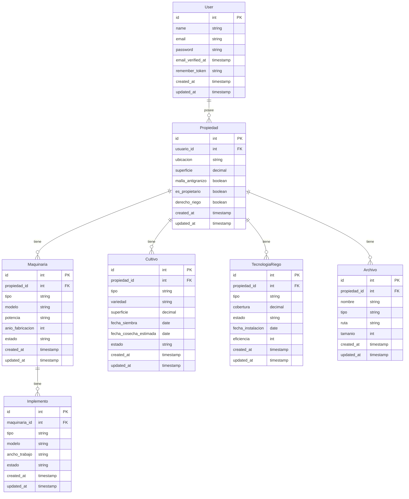

```mermaid
erDiagram
    User ||--o{ Propiedad : posee
    Propiedad ||--o{ Maquinaria : tiene
    Propiedad ||--o{ Cultivo : tiene
    Propiedad ||--o{ TecnologiaRiego : tiene
    Propiedad ||--o{ Archivo : tiene
    Maquinaria ||--o{ Implemento : tiene

    User {
        id int PK
        name string
        email string
        password string
        email_verified_at timestamp
        remember_token string
        created_at timestamp
        updated_at timestamp
    }

    Propiedad {
        id int PK
        usuario_id int FK
        ubicacion string
        superficie decimal
        malla_antigranizo boolean
        es_propietario boolean
        derecho_riego boolean
        created_at timestamp
        updated_at timestamp
    }

    Maquinaria {
        id int PK
        propiedad_id int FK
        tipo string
        modelo string
        potencia string
        anio_fabricacion int
        estado string
        created_at timestamp
        updated_at timestamp
    }

    Implemento {
        id int PK
        maquinaria_id int FK
        tipo string
        modelo string
        ancho_trabajo string
        estado string
        created_at timestamp
        updated_at timestamp
    }

    Cultivo {
        id int PK
        propiedad_id int FK
        tipo string
        variedad string
        superficie decimal
        fecha_siembra date
        fecha_cosecha_estimada date
        estado string
        created_at timestamp
        updated_at timestamp
    }

    TecnologiaRiego {
        id int PK
        propiedad_id int FK
        tipo string
        cobertura decimal
        estado string
        fecha_instalacion date
        eficiencia int
        created_at timestamp
        updated_at timestamp
    }

    Archivo {
        id int PK
        propiedad_id int FK
        nombre string
        tipo string
        ruta string
        tamanio int
        created_at timestamp
        updated_at timestamp
    }
```
