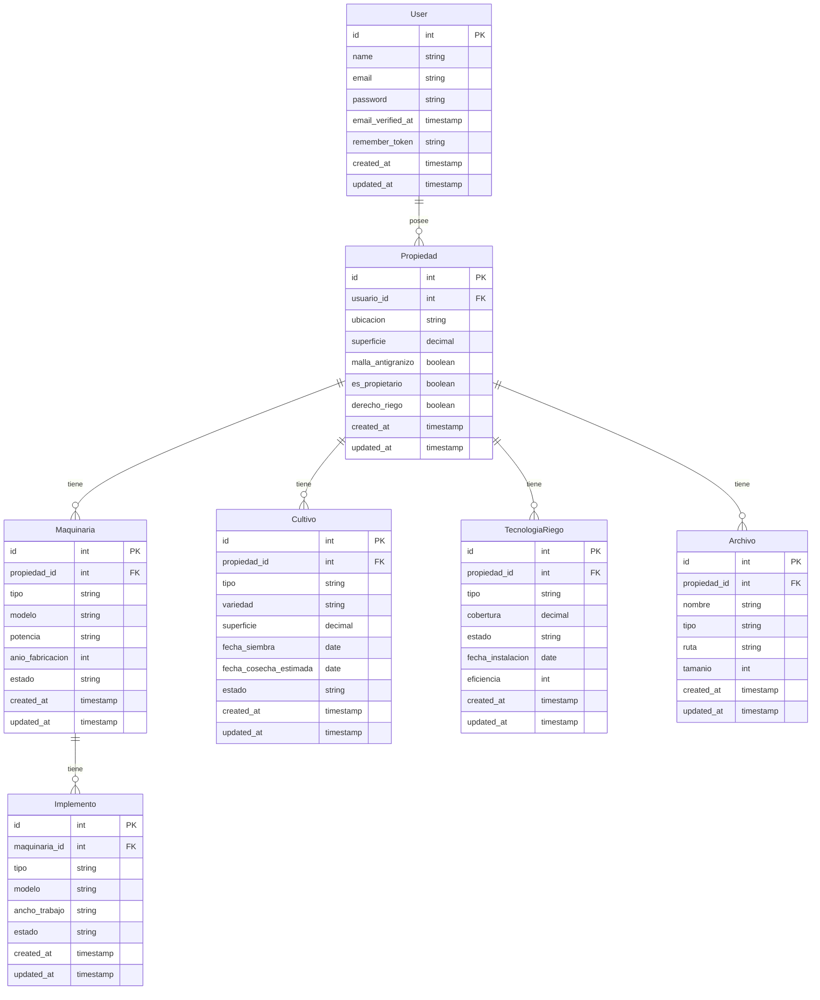

# Documentación Técnica - Sistema Agrícola SAP

## Arquitectura del Sistema

### Tecnologías Utilizadas

El Sistema Agrícola SAP está desarrollado utilizando las siguientes tecnologías:

- **Backend**: Laravel 10 (PHP 8.1+)
- **Frontend**: 
  - Blade Templates
  - TailwindCSS
  - Alpine.js para interactividad en el cliente
- **Base de Datos**: SQLite (desarrollo) / MySQL (producción)
- **Entorno de Desarrollo**: Visual Studio Code, Laravel Sail
- **Control de Versiones**: Git

### Estructura de Directorios

El proyecto sigue la estructura estándar de Laravel con algunas personalizaciones:

```
sistema_productores/
├── app/                      # Código principal de la aplicación
│   ├── Http/                 # Controladores, Middlewares, Requests
│   ├── Models/               # Modelos Eloquent
│   └── Providers/            # Service Providers
├── bootstrap/                # Archivos de inicio de Laravel
├── config/                   # Configuración de la aplicación
├── database/                 # Migraciones, seeds, factories
├── documentacion/            # Documentación del proyecto
├── public/                   # Punto de entrada y assets públicos
├── resources/                # Assets sin compilar (CSS, JS, vistas)
│   ├── css/                  # Archivos CSS/SCSS
│   ├── js/                   # Archivos JavaScript
│   └── views/                # Plantillas Blade
├── routes/                   # Definiciones de rutas
│   ├── api.php               # Rutas API
│   └── web.php               # Rutas web
├── storage/                  # Archivos generados por la aplicación
└── tests/                    # Tests automatizados
```

## Modelos de Datos

### Diagrama Entidad-Relación

El siguiente diagrama muestra las relaciones entre las principales entidades del sistema:



### Principales Entidades

#### User (Usuario)
```php
Schema::create('users', function (Blueprint $table) {
    $table->id();
    $table->string('name');
    $table->string('email')->unique();
    $table->timestamp('email_verified_at')->nullable();
    $table->string('password');
    $table->rememberToken();
    $table->timestamps();
});
```

#### Propiedad
```php
Schema::create('propiedades', function (Blueprint $table) {
    $table->id();
    $table->foreignId('user_id')->constrained()->onDelete('cascade');
    $table->string('nombre');
    $table->string('ubicacion');
    $table->decimal('superficie', 10, 2);
    $table->boolean('malla_antigranizo')->default(false);
    $table->enum('estatus', ['propietario', 'arrendatario']);
    $table->boolean('derechos_riego')->default(false);
    $table->timestamps();
});
```

#### Maquinaria
```php
Schema::create('maquinarias', function (Blueprint $table) {
    $table->id();
    $table->foreignId('propiedad_id')->nullable()->constrained()->onDelete('set null');
    $table->string('nombre');
    $table->string('tipo');
    $table->integer('anio_fabricacion');
    $table->text('caracteristicas')->nullable();
    $table->timestamps();
});
```

#### Implemento
```php
Schema::create('implementos', function (Blueprint $table) {
    $table->id();
    $table->foreignId('maquinaria_id')->nullable()->constrained()->onDelete('set null');
    $table->string('nombre');
    $table->string('tipo');
    $table->text('caracteristicas')->nullable();
    $table->timestamps();
});
```

#### Cultivo
```php
Schema::create('cultivos', function (Blueprint $table) {
    $table->id();
    $table->foreignId('propiedad_id')->constrained()->onDelete('cascade');
    $table->string('tipo');
    $table->decimal('superficie', 10, 2);
    $table->date('fecha_siembra');
    $table->date('fecha_cosecha_estimada')->nullable();
    $table->timestamps();
});
```

#### TecnologiaRiego
```php
Schema::create('tecnologia_riegos', function (Blueprint $table) {
    $table->id();
    $table->foreignId('propiedad_id')->constrained()->onDelete('cascade');
    $table->string('tipo');
    $table->text('caracteristicas')->nullable();
    $table->decimal('superficie_cubierta', 10, 2);
    $table->timestamps();
});
```

#### Archivo
```php
Schema::create('archivos', function (Blueprint $table) {
    $table->id();
    $table->string('titulo');
    $table->text('descripcion')->nullable();
    $table->string('categoria');
    $table->string('ruta');
    $table->string('tipo_mime');
    $table->string('extension');
    $table->integer('tamano');
    $table->morphs('archivable'); // Relación polimórfica
    $table->timestamps();
});
```

## Relaciones entre Modelos

### User (Usuario)
- **hasMany** Propiedad: Un usuario puede tener múltiples propiedades

### Propiedad
- **belongsTo** User: Una propiedad pertenece a un usuario
- **hasMany** Maquinaria: Una propiedad puede tener múltiples maquinarias
- **hasMany** Cultivo: Una propiedad puede tener múltiples cultivos
- **hasMany** TecnologiaRiego: Una propiedad puede tener múltiples tecnologías de riego
- **morphMany** Archivo: Una propiedad puede tener múltiples archivos asociados

### Maquinaria
- **belongsTo** Propiedad: Una maquinaria puede estar asociada a una propiedad
- **hasMany** Implemento: Una maquinaria puede tener múltiples implementos
- **morphMany** Archivo: Una maquinaria puede tener múltiples archivos asociados

### Implemento
- **belongsTo** Maquinaria: Un implemento está asociado a una maquinaria
- **morphMany** Archivo: Un implemento puede tener múltiples archivos asociados

### Cultivo
- **belongsTo** Propiedad: Un cultivo está asociado a una propiedad
- **morphMany** Archivo: Un cultivo puede tener múltiples archivos asociados

### TecnologiaRiego
- **belongsTo** Propiedad: Una tecnología de riego está asociada a una propiedad
- **morphMany** Archivo: Una tecnología de riego puede tener múltiples archivos asociados

### Archivo
- **morphTo** archivable: Un archivo puede estar asociado a cualquier modelo (relación polimórfica)

## API y Endpoints

El sistema no expone una API pública, pero internamente utiliza los siguientes endpoints principales:

### Autenticación
- `GET /login` - Muestra formulario de inicio de sesión
- `POST /login` - Autentica al usuario
- `POST /logout` - Cierra sesión
- `GET /register` - Muestra formulario de registro
- `POST /register` - Registra un nuevo usuario

### Propiedades
- `GET /propiedades` - Lista todas las propiedades del usuario
- `GET /propiedades/create` - Muestra formulario para crear propiedad
- `POST /propiedades` - Crea una nueva propiedad
- `GET /propiedades/{id}` - Muestra detalles de una propiedad
- `GET /propiedades/{id}/edit` - Muestra formulario para editar propiedad
- `PUT/PATCH /propiedades/{id}` - Actualiza una propiedad
- `DELETE /propiedades/{id}` - Elimina una propiedad

### Otros Módulos
Todos los demás módulos (Maquinaria, Implementos, Cultivos, Tecnologías de Riego, Archivos) siguen un patrón de rutas RESTful similar al de Propiedades.

## Seguridad

### Autenticación y Autorización

- **Autenticación**: El sistema utiliza el sistema de autenticación incorporado de Laravel con sesiones.
- **Autorización**: Se implementan políticas de autorización para cada modelo utilizando el sistema de Gates y Policies de Laravel.
- **Middleware**: Se aplican middleware para proteger rutas, incluyendo:
  - `auth`: Verifica que el usuario esté autenticado
  - `verified`: Verifica que el correo electrónico del usuario esté verificado
  - `throttle`: Limita el número de intentos de inicio de sesión

### Validación de Datos

Todas las entradas de usuario son validadas utilizando las clases Request de Laravel, aplicando reglas de validación estrictas para prevenir entradas maliciosas.

### Protección CSRF

El sistema implementa protección CSRF (Cross-Site Request Forgery) mediante tokens CSRF en todos los formularios.

## Interfaz de Usuario

### Componentes UI

El sistema utiliza un conjunto personalizado de componentes UI basados en el diseño SAP Fiori:

- **Cards**: Contenedores principales para información
- **Forms**: Formularios estandarizados con validación visual
- **Tables**: Tablas de datos con opciones de ordenamiento y filtrado
- **Buttons**: Botones con estados visuales claros (primario, secundario, peligro)
- **Alerts**: Sistema de notificaciones con códigos de color según su tipo

### Estilos y Temas

Los estilos están implementados utilizando TailwindCSS con una configuración personalizada que define la paleta de colores SAP Fiori.

### Interfaz MDI (Multiple Document Interface)

La interfaz tipo MDI permite trabajar con múltiples formularios simultáneamente, implementada mediante componentes JavaScript que gestionan ventanas virtuales dentro del espacio de trabajo principal.

## Pruebas

### Entorno de Pruebas

Las pruebas se ejecutan utilizando PHPUnit/Pest para pruebas de PHP y Jest para pruebas de JavaScript.

### Tipos de Pruebas

- **Pruebas Unitarias**: Prueban componentes individuales y métodos
- **Pruebas de Integración**: Prueban la interacción entre componentes
- **Pruebas de Características**: Prueban características completas del sistema
- **Pruebas de Navegador**: Prueban la UI utilizando Laravel Dusk

## Despliegue

### Requisitos del Servidor

- PHP 8.1 o superior
- Composer
- Servidor web (Apache/Nginx)
- MySQL 8.0 o superior (recomendado para producción)
- Extensiones PHP: PDO, JSON, Fileinfo, OpenSSL, Tokenizer, Mbstring

### Proceso de Despliegue

1. Clonar el repositorio
2. Instalar dependencias: `composer install --optimize-autoloader --no-dev`
3. Configurar variables de entorno: Copiar `.env.example` a `.env` y configurar
4. Generar clave de aplicación: `php artisan key:generate`
5. Ejecutar migraciones: `php artisan migrate --force`
6. Optimizar la aplicación:
   ```
   php artisan config:cache
   php artisan route:cache
   php artisan view:cache
   ```
7. Configurar permisos de directorios:
   ```
   chmod -R 775 storage
   chmod -R 775 bootstrap/cache
   ```

## Mantenimiento y Desarrollo Futuro

### Roadmap

- **Fase 1** (Completada): Implementación de módulos básicos y autenticación
- **Fase 2** (En progreso): Mejoras de UI/UX y optimización de rendimiento
- **Fase 3** (Planificada): Sistema de analítica y reportes
- **Fase 4** (Planificada): Integración con sistemas externos (meteorológicos, contables)

### Contribución al Proyecto

Para contribuir al proyecto:

1. Hacer fork del repositorio
2. Crear una rama para su característica: `git checkout -b feature/nueva-caracteristica`
3. Realizar cambios y commits: `git commit -m 'Añadir nueva característica'`
4. Enviar cambios al fork: `git push origin feature/nueva-caracteristica`
5. Crear un Pull Request

### Convenciones de Código

El proyecto sigue las convenciones PSR-12 para código PHP y el estilo de código de Laravel.

## Resolución de Problemas

### Problemas Comunes

- **Error de Base de Datos**: Verificar credenciales en `.env` y permisos de usuario
- **Error 500**: Revisar logs en `storage/logs/laravel.log`
- **Problemas de Permisos**: Verificar permisos de directorios `storage` y `bootstrap/cache`
- **Caché de Configuración**: Limpiar caché con `php artisan config:clear`

### Soporte

Para soporte técnico, contactar a través de:
- Email: soporte@sistemaagricola.com
- Repositorio de Issues en GitHub
